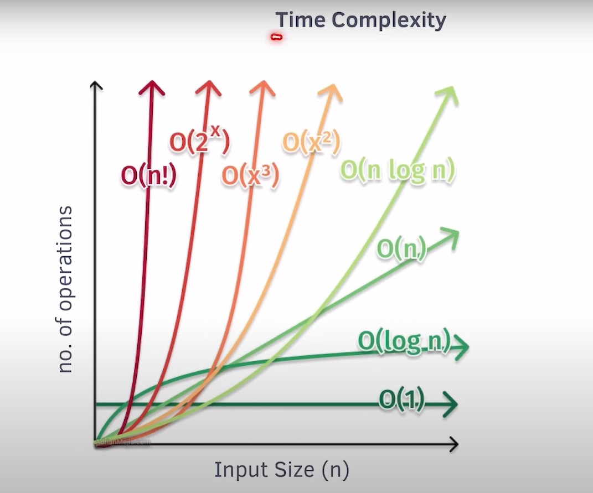

# Time & Space Complexity
- Coding plateform
- interview
- in OA for efficient Solution finding.
- it is useful in every complexity.

## Time Complexity

- != The Actual Time taken(Terms of Operation) but not `amount of time taken as function of input size(n).`

- Machine dependent and sever depedent.

- Input Size(operation).

### Example 
- Linear Search - Target.
- Array input. it can very size is veriable.

```c++
int target;
cin >> target;
for(i = 0; i<n;i++){
    if(arr[i] == target){
        return i; // worst case last index element found.

    }
    return -1;
}
```

- n = 1  -  1 Op.
- n = 10 - 10 Op.
- n = 100 - 100 Op.
- n = 10^5 - 10^5 Op.  Approx

- input increase and operation also increase.
- we can Plot on Graph.> straight line O(n) . f(n) = n.

## Type of complexity
- it gives us behaviour,
- we calculate for worst case,
- we want our algorithm performance billion user.
- compare to algo which one is faster.
- Big O notation is symbol for depict function of time complexity.

1) Linear O(n) -> show worst case synario.

### How to find Complexity of given number?
- F(n) = 4n^2 + 3n + 5
1. ignore constant n^2 + n + 1
2. largest term -> O(n^2)
3. wost case O and avg is theta and best omega.

- cormen book,masters theorem.

- O calculation always ask in interview.

## Space Complexity
- Amount of space taken by algorithm as function of input size (n).
- Input (vec,arr,string..)
- Auxilory function
- input -> arr[]
- out - secarr[] -> auxilory space actually increase.

- inp -> arr[]
- out -> sum
```c++
int sum = 0;
for(i= 0;i <n;i++){
    sum+=arr[i];
}
cout <<sum; 

```

- space complexity for variable is called O(k).
- O(1),O(n).


### Interview POV Majority focus on space complexity modern system are important time complexity and space is cheap now a days.

## Complexity good and bad.

- O(1) > O(log n) > O (n) > O(n log n) > O(n^2) > O(n^3) > O(2^n) > O(n!)

### Common Time Complexities.
- O(1) - Constant

-Sum of numbrers from 1 to N
```c++
int n;
cin >> n;
int ans = n*(n+1)/2;

```

- O(k) = O(1)


## Hash Tabke -> unordermap
- Imotize avg we can tell O(1).

## Common time Complexities.

- O(n) - Linear

1) N Factorial


```c++
int fact = 1;
for(int i =1; i<= n; i++){
    fact *= i; // Constant O(n)

}


```

2) Nth Fibonacci - DP
```c++
for(int i = 2; i<=n; i++){
    dp[i] = dp[i-1] + dp[i-2]; //Constant O(n)
}

```

3) Kadane's Algorithm
```c++
int currSum =0,ans = INT_MIN;
for(int i = 0; i <n; i++){
    currSum += arr[i];
    ans = max(currSum,ans);
    currSum = currSum < 0 ? 0 : currSum; // Constant O(n*k) // O(n)

}
// ## Moore's Voting Algorithm -> O(n) -> Linear
```

## O(n^2) & O(n^3)
- O(n^2) -> 

1) Bubble Sort, Selection Sort, insertion sort,bubble sort.
- Bubble sort. outer loop run n times and inner loop also run n times. O(n^2).

- i = 0 - j = 0,1,2
- i = 1 - j = 0,1
- i = 2 - j = 0


```c++
for(int i = 0; i < n-1 ; i++){
    for(int j = 0; j < n-1 ; j++){
        if(arr[j] > arr[j+1]){
            swap(arr[j],arr[j+1]);
        }
    }
}
```


## First time outer run n times run and inner loop run 3 times and perform k times.

- (n-1)k + (n-2)k + (n-3)k + ......... 2k + k
