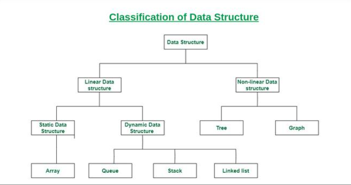

# Data Structure

> Data structures are the fundamental building blocks of computer programming. They define how data is organized, stored, and manipulated within a program. Understanding data structures is very important for developing efficient and effective algorithms.

- What is Data Structure?
> A data structure is a storage that is used to store and organize data. It is a way of arranging data on a computer so that it can be accessed and updated efficiently.
>A data structure is not only used for organizing the data. It is also used for processing, retrieving, and storing data. There are different basic and advanced types of data structures that are used in almost every program or software system that has been developed. So we must have good knowledge about data structures. 

## Classification of Data Structure

1. **Linear Data Structure:** -  Data structure in which data elements are arranged sequentially or linearly, where each element is attached to its previous and next adjacent elements, is called a linear data structure. 
**Example:** Array, Stack, Queue, Linked List, etc.

2. **Static Data Structure:** Static data structure has a fixed memory size. It is easier to access the elements in a static data structure. 
**Example:** array.

3. **Dynamic Data Structure:** In dynamic data structure, the size is not fixed. It can be randomly updated during the runtime which may be considered efficient concerning the memory (space) complexity of the code. 
**Example:**: Queue, Stack, etc.

4. **Non-Linear Data Structure:** Data structures where data elements are not placed sequentially or linearly are called non-linear data structures. In a non-linear data structure, we can’t traverse all the elements in a single run only. 
**Examples:**: Trees and Graphs.

# 