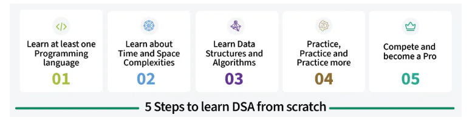
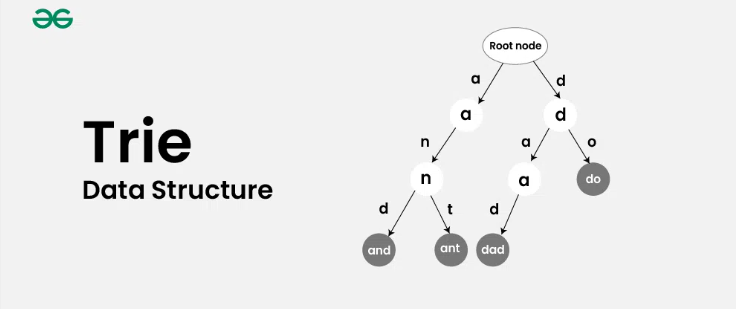
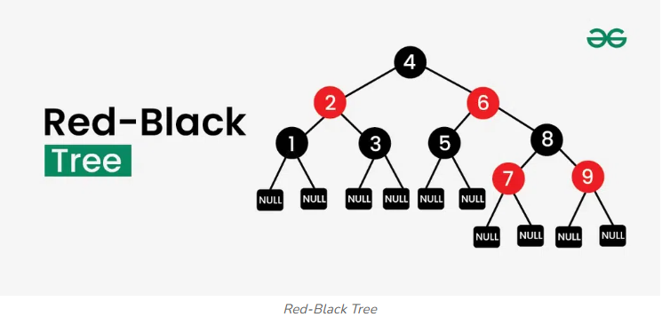

# Data Structures and Algorithms

>DSA (Data Structures and Algorithms) is the study of organizing data efficiently using data structures like arrays, stacks, and trees, paired with step-by-step procedures (or algorithms) to solve problems effectively. Data structures manage how data is stored and accessed, while algorithms focus on processing this data.

## Why to Learn DSA?
- Learning DSA boosts your problem-solving abilities and make you a stronger programmer.

- DSA is foundation for almost every software like GPS, Search Engines, AI ChatBots, Gaming Apps, Databases, Web Applications, etc.

- Top Companies like Google, Microsoft, Amazon, Apple, Meta and many other heavily focus on DSA in interviews.

## How to learn DSA?

1. Learn at-least one programming language [C++](https://www.geeksforgeeks.org/c-plus-plus/)
, [JAVA](https://www.geeksforgeeks.org/java/)
 , [Python](https://www.geeksforgeeks.org/python-programming-language-tutorial/)
  or [JavaScript](https://www.geeksforgeeks.org/javascript/javascript-tutorial/)   and build your basic logic.

2. Learn about [Time and Space complexities](https://www.geeksforgeeks.org/time-complexity-and-space-complexity/)

3. Learn Data Structures (Arrays, Linked List, etc) and Algorithms (Searching, Sorting, etc).
4. Once you learn main topics, it is important to solve coding problems against some predefined test cases,
5. Solve problems daily using GfG Problem of the Day,Leetcode, Codeforces etc.

Hoping you have learned a programming language of your choice, here comes the next stage of the roadmap - Learn about Time and Space Complexities.

## **1. Logic Building**
Once you have learned basics of a programming language, it is recommended that you learn basic logic building

- [Logic Building Guide](https://www.geeksforgeeks.org/logic-building-problems/)
- [Quiz on Logic Building](https://www.geeksforgeeks.org/quizzes/dsa-tutorial-logic-building/)

## **2. Learn about Complexities**
To analyze algorithms, we mainly measure order of growth of time or space taken in terms of input size. We do this in the worst case scenario in most of the cases. Please refer the below links for a clear understanding of these concepts.

- [Complexity Analysis Guide](https://www.geeksforgeeks.org/analysis-of-algorithms/)
- [Quiz on Complexity Analysis](https://www.geeksforgeeks.org/quizzes/quiz-on-complexity-analysis-for-dsa/)

## **3. Array**
**Array** is a linear data structure where elements are allocated **contiguous memory**, allowing for **constant-time access**.
- [Array Data Structure Guide](https://www.geeksforgeeks.org/array-data-structure-guide/)
- [Quiz on Arrays](https://www.geeksforgeeks.org/quizzes/dsa-tutorial-array/)

## **4. Searching Algorithms**

**Searching algorithms** are used to locate specific data within a large set of data. It **helps find a target value** within the data. There are various types of searching algorithms, each with its own approach and efficiency.

- [Searching Algorithms Guide](https://www.geeksforgeeks.org/searching-algorithms/)
- [Quiz on Searching](https://www.geeksforgeeks.org/quizzes/top-mcqs-on-searching-algorithm-with-answers/)

## **5. Sorting Algorithm**
**Sorting algorithms** are used to **arrange** the elements of a list in a specific order, such as numerical or alphabetical. It organizes the items in a systematic way, making it easier to search for and access specific elements.
- [Sorting Algorithms Guide](https://www.geeksforgeeks.org/sorting-algorithms/)
- [Quiz on Sorting](https://www.geeksforgeeks.org/quizzes/top-mcqs-on-sorting-algorithms-with-answers/)

## **6. Hashing**
Hashing is a technique that generates a fixed-size output (hash value) from an input of variable size using mathematical formulas called hash functions. Hashing is commonly used in data structures for efficient searching, insertion and deletion.
- [Hashing Guide](https://www.geeksforgeeks.org/hashing-data-structure/)
- [Quiz on Hashing](https://www.geeksforgeeks.org/quizzes/top-mcqs-on-hash-data-strcuture-with-answers/)

## **7. Two Pointer Technique**
In Two Pointer Technique, we typically use two index variables from two corners of an array. We use the two pointer technique for searching a required point or value in an array.
- [Two Pointer Technique](https://www.geeksforgeeks.org/two-pointers-technique/)
- [Quiz on Two Pointer Technique](https://www.geeksforgeeks.org/quizzes/quiz-on-two-pointer-technique-for-dsa/)

## **8. Window Sliding Technique**
In Window Sliding Technique, we use the result of previous subarray to quickly compute the result of current.
- [Window Sliding Technique](https://www.geeksforgeeks.org/window-sliding-technique/)
- [Quiz on Sliding Window](https://www.geeksforgeeks.org/quizzes/quiz-on-sliding-window-technique-for-dsa/)

## **9. Prefix Sum Technique**
In Prefix Sum Technique, we compute prefix sums of an array to quickly find results for a subarray.
- [Prefix Sum Technique](https://www.geeksforgeeks.org/prefix-sum-array-implementation-applications-competitive-programming/)
- [Quiz on Prefix Sum](https://www.geeksforgeeks.org/quizzes/quiz-on-prefix-sum-for-dsa/)

## **10. String**
String is a sequence of characters, typically immutable and have limited set of elements (lower case or all English alphabets).

- [Strings Guide](https://www.geeksforgeeks.org/string-data-structure/)
- [Quiz on Strings](https://www.geeksforgeeks.org/quizzes/quiz-on-string-for-dsa/)

**11. Recursion**
Recursion is a programming technique where a function calls itself within its own definition. It is usually used to solve problems that can be broken down into smaller instances of the same problem.
- [Recursive Algorithms Guide](https://www.geeksforgeeks.org/recursion-algorithms/)
- [Quiz on Recursion](https://www.geeksforgeeks.org/quizzes/top-mcqs-on-recursion-algorithm-with-answers/)

**12. Matrix/Grid**
Matrix is a two-dimensional array of elements, arranged in rows and columns. It is represented as a rectangular grid, with each element at the intersection of a row and column.
- [Matrix Guide](https://www.geeksforgeeks.org/matrix/)
- [Quiz on Matrix/Grid.](https://www.geeksforgeeks.org/quizzes/quiz-on-matrixgrid-for-dsa/)

**13. Linked List**
Linked list is a linear data structure that stores data in nodes, which are connected by pointers. Unlike arrays, nodes of linked lists are not stored in contiguous memory locations and can only be accessed sequentially, starting from the head of list.
- [Linked List Guide](https://www.geeksforgeeks.org/linked-list-data-structure/)
- [Quiz on Linked List](https://www.geeksforgeeks.org/quizzes/top-mcqs-on-linked-list-data-structure-with-answers/)

**14. Stack**
Stack is a linear data structure that follows the Last In, First Out (LIFO) principle. Stacks play an important role in managing function calls, memory, and are widely used in algorithms like stock span problem, next greater element and largest area in a histogram.
- [Stack Guide](https://www.geeksforgeeks.org/stack-data-structure/)
- [Quiz on Stack](https://www.geeksforgeeks.org/quizzes/top-mcqs-on-stack-data-strcuture-with-answers/)

**15. Queue**
Queue is a linear data structure that follows the First In, First Out (FIFO) principle. Queues play an important role in managing tasks or data in order, scheduling and message handling systems.
- [Queue Guide](https://www.geeksforgeeks.org/queue-data-structure/)
- [Quiz on  Queue](https://www.geeksforgeeks.org/quizzes/top-mcqs-on-queue-data-structure-with-answers/)

**16. Deque**
A deque (double-ended queue) is a data structure that allows elements to be added or removed from both ends efficiently.
- [Deque Guide](https://www.geeksforgeeks.org/deque-set-1-introduction-applications/)
- [Quiz on Deque](https://www.geeksforgeeks.org/quizzes/deque-960/)

**17. Tree**
Tree is a non-linear, hierarchical data structure consisting of nodes connected by edges, with a top node called the root and nodes having child nodes. It is widely used in file systems, databases, decision-making algorithms, etc.
- [Tree Data Structure Guide](https://www.geeksforgeeks.org/tree-data-structure/)
- [Quiz on Tree](https://www.geeksforgeeks.org/quizzes/tree-22648//)

**18. Heap**
Heap is a complete binary tree data structure that satisfies the heap property. Heaps are usually used to implement priority queues, where the smallest or largest element is always at the root of the tree.
- [Heap Guide](https://www.geeksforgeeks.org/heap-data-structure/)
- [Quiz on Heap](https://www.geeksforgeeks.org/quizzes/top-mcqs-on-heap-data-strcuture-with-answers/)

**19. Graph**
Graph is a non-linear data structure consisting of a finite set of vertices(or nodes) and a set of edges(or links)that connect a pair of nodes. Graphs are widely used to represent relationships between entities.
- [Graph Guide](https://www.geeksforgeeks.org/graph-data-structure-and-algorithms/)
- [Quiz on Graph](https://www.geeksforgeeks.org/quizzes/graph-12715/)

**20. Greedy Algorithm**
Greedy Algorithm builds up the solution one piece at a time and chooses the next piece which gives the most obvious and immediate benefit i.e., which is the most optimal choice at that moment. So the problems where choosing locally optimal also leads to the global solutions are best fit for Greedy.
- [Greedy Algorithms Guide](https://www.geeksforgeeks.org/greedy-algorithms/)
- [Quiz on Greedy](https://www.geeksforgeeks.org/quizzes/top-mcqs-on-greedy-algorithms-with-answers/)

**21. Dynamic Programming**
Dynamic Programming is a method used to solve complex problems by breaking them down into simpler subproblems. By solving each subproblem only once and storing the results, it avoids redundant computations, leading to more efficient solutions for a wide range of problems.
- [Dynamic Programming Guide](https://www.geeksforgeeks.org/dynamic-programming/)
- [Quiz on DP](https://www.geeksforgeeks.org/quizzes/top-mcqs-on-dynamic-programming-with-answers/)

**22. Other Algorithms**

**Bitwise Algorithms:** Operate on individual bits of numbers.
- [Bitwise Algorithms Guide](https://www.geeksforgeeks.org/bitwise-algorithms/)
- [Quiz on  Bit Magic](https://www.geeksforgeeks.org/quizzes/top-mcqs-on-bitwise-algorithms-and-bit-manipulations-with-answers/)

**Backtracking Algorithm:**Follow Recursion with the option to revert and traces back if the solution from current point is not feasible.
- [Backtracking Guide](https://www.geeksforgeeks.org/backtracking-algorithms/)
- [Quiz on Backtracking](https://www.geeksforgeeks.org/quizzes/top-mcqs-on-backtracking-algorithm-with-answers/)

**Divide and conquer:**A strategy to solve problems by dividing them into smaller subproblems, solving those subproblems, and combining the solutions to obtain the final solution.
- [Divide and Conquer Guide](https://www.geeksforgeeks.org/divide-and-conquer/)
- [Quiz on Divide and Conquer](https://www.geeksforgeeks.org/quizzes/top-mcqs-on-divide-and-conquer-algrithm-with-answers/)

**Branch and Bound :** Used in combinatorial optimization problems to systematically search for the best solution. It works by dividing the problem into smaller subproblems, or branches, and then eliminating certain branches based on bounds on the optimal solution. This process continues until the best solution is found or all branches have been explored.
- [Branch and Bound Algorithm](https://www.geeksforgeeks.org/branch-and-bound-algorithm/)

**Geometric algorithms:** are a set of algorithms that solve problems related to shapes, points, lines and polygons.
- [Geometric Algorithms](https://www.geeksforgeeks.org/geometric-algorithms/)

- [Practice Geometric Algorithms](https://www.geeksforgeeks.org/explore?page=1&category=Geometric&sortBy=submissions)

**Randomized algorithms:** are algorithms that use randomness to solve problems. They make use of random input to achieve their goals, often leading to simpler and more efficient solutions. These algorithms may not product same result but are particularly useful in situations when a probabilistic approach is acceptable.
- [Randomized Algorithms](https://www.geeksforgeeks.org/randomized-algorithms/)

### 23. Advanced Data Structure and Algorithms
Advanced Data Structures like **Trie**, **Segment Tree**, **Red-Black Tree** and **Binary Indexed Tree** offer significant performance improvements for specific problem domains. They provide efficient solutions for tasks like fast prefix searches, range queries, dynamic updates, and maintaining balanced data structures, which are crucial for handling large datasets and real-time processing.

1) Trie
- [Trie](https://www.geeksforgeeks.org/introduction-to-trie-data-structure-and-algorithm-tutorials/)
- 

2) Segment Tree
- [Segment Tree](https://www.geeksforgeeks.org/introduction-to-segment-trees-2/)

3) Red-Black Tree
- [Red-Black Tree](https://www.geeksforgeeks.org/introduction-to-red-black-tree/)
- 

4) Binary Indexed Tree
- [Binary Indexed Tree](https://www.geeksforgeeks.org/fenwick-tree-for-competitive-programming/)

5) Practice Advanced Data Structures
- [Practice Advanced Data Structures](https://www.geeksforgeeks.org/advance-data-structure/)
