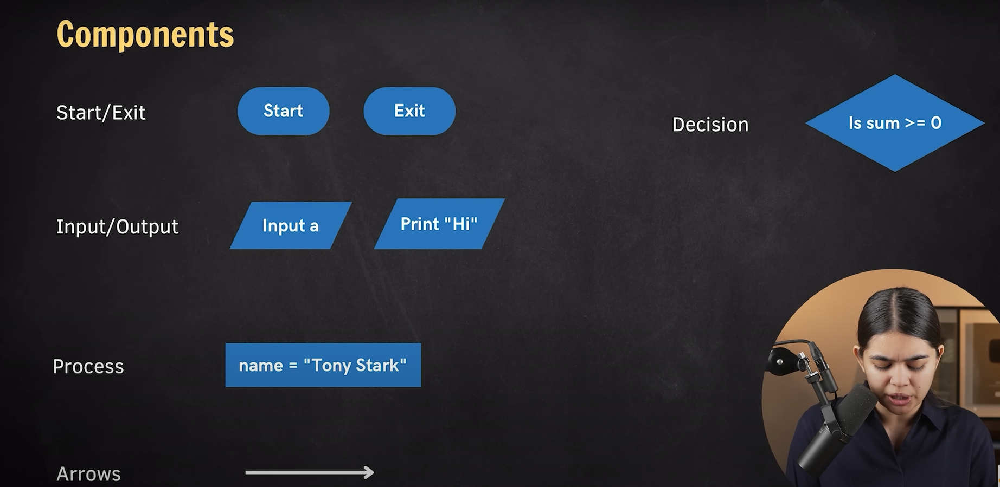

# How to solve a problem?

- How to approach any problem ?
1) understand - Understand the problem and what it wants to say ?
2) Input - Intput clarity
3) Solution - Find the effective solution.
4) Code - Convert solution to code. 

- Problem : find sum of 2 numbers : a & b.

## Flowchart
- Diaglram of a solution.

### steps: 
- Start - oval
- Input - Perellalo gram
- Process   - Process box squre (Ractangle)
- Output - Perellalogram
- exit - oval

- Solution flow - Arrow.

- Desicion - Diamond. 

- Code Basically Takes input perform some operation and give certain amount of output.

## Pseudo-code
>General Logic of Solution, simple english like code.

1. Input 
2. Process
3. Output
4. exit (optional)

- Sum of Two number. 
- logic addition.
e.g. 
1. Input a & b.
2. sum = a + b
3. print sum.
4. exit

- Pesudo code is just for understanding.

##### Area of a Squre.
- logic multyplication
e.g. 
1. Input length.
2. area = length * length.
3. print area.
4. exit.

#####  Min of 2 Numbers
- logic comparison

e.g.
1. Input Numbers.
2. Compare Check the condtion Num1 < Num2 or Num2 < Num1.
3. print the min num .
4. exit.

- input a&b.
- if a < b:
     print a
 else: 
   print b
- exit

##### Is number Odd or Even
- logic remender 0.

1. input number.
2. if number % 2 == 0:
        print("even")
    else:
        print("odd")
3. exit

##### Sum of n number.
- Mathemetical Approach - n*(n+1)/2 
- Logical Programming approach

1. input n
2. sum = 0,i = 1
3. for i in range(n+1): (check condition and run loop untill condition become false.until i(count) becomes n).
    sum += i

3. while(i<n):
    sum += i  (sum = sum + i)
    i += 1  (i++)

4. print sum
5. exit

- in programming which task are repitive we use loops.

##### Is number Prime or not.

- Mathemetical Approach - prime -> it occur in 1's table or in only in it's table. or prime number has only two factors.
- **note** - Two is only Even prime.
e.g. factors:  prime: 3 -> 1, 3 , nonprime: 4 -> 2,2,1,4 etc.

- Logical Programming approach.
1. we have to check only number is find modulo by 2 to n-1 or not. remender is 0 or not.

- Steps:
1. input n
2. i = 2
3. while(i <= n-1):
     if n % i == 0:
        prime("non prime") 
        exit
     else:
        i += 1
4. print prime
5. exit

#### Assignment Qustions:

a. Calculate "Simple Intrerest" from Principal(P), Rate(R) & Time(T).
b. Calculate Max of 2 numbers.
c. Calculate Factorial of a number N.
d. Given a personal's age, find if they should get a driving license or not.

##### Calculate "Simple Intrerest" from Principal(P), Rate(R) & Time(T).

- Mathemetical Approach - 

- **note** - Simple interest = Principal * Rate * Time

- Logical Programming approach.
1. Calcualte simple interest using multyplication perform operation on given inputs.

- Steps:
1. input P,R,T
2. S.I = P* R *T
3. print(S.I)
4. exit

##### Calculate Max of 2 Numbers.

- Mathemetical Approach - 
- Logical Programming approach.

- **Logic** - Compare the values and decide

- Steps:
1. input a,b
2. if a > b:
    print("a is maximum")
    else:
    print("b is maximum")

3. print(S.I)
4. exit
