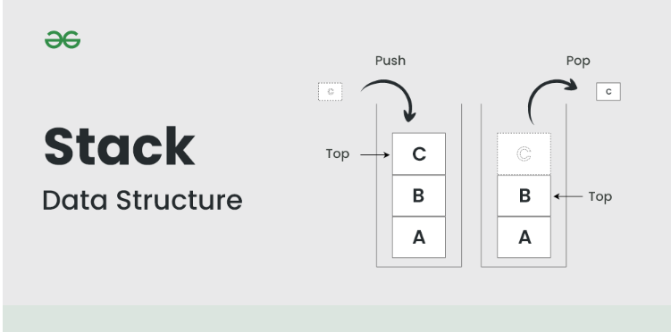
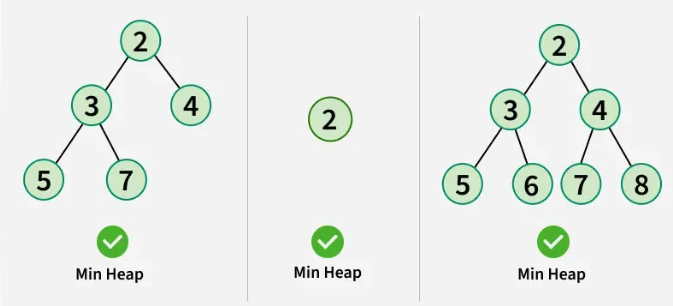

# Functions
- Functions are really simple concept and it gives life to a programming. majoritily everything is done in tech is based on Functions.
 
> "In Programming which task you want to do it again and again. you can write work and split it in form of functions"

- it is not doing for simple task like calculate sum. in future their will be so many complex problem will be solved by function and so many line of code can break it into chunks.

- some task will be repetive so we break the logic into chunks and we want our code should be readable and avoid redantancy(code repetive in programme).we should avoid reduntancy.

- Always have habit which task you want to repeat in your programme 3-4 time it should be done with function.


## Function Syntax

```c++
  returnType printHello(){
        cout << "Hello" << endl;
    }
    return 0;
```
- Function is inheritly like black box, it takes cetain amount of input and process it and return some output like.
for e.g. main function is returning 0 if it's type is int. function should be return something.

- **remeber** - After return type function will not do any work.


### Functions Parts
> "define , pass params and invoke and pass args(Formal params) on which you have to perform perticular task."
1) Function Defination
- In a Function Defination we write a clear logic for doing specific task. we decare a function with return type.

2) Function Call
- function is a helper for specific task and it works when it's called

- if you can't call a function it will not do anything. it can be called so many time if you want and it should be called in other function or main function. if it is calling it self it will become `recursive function` will see leter on.

- `Functionname()`  - Function Call


3) Function Parameters
- Function Takes some inputs and perform some specific task on certain values it's called Parameters.

```c++
// num1 and num2 are called parameters.function which takes input num1, num2 and gives output.

int sum(int num1,int num2){
    cout << "The Sum is "<< num1+num2 << endl;
    return 0;
}
```

- in function parameters there are always be pass literals `littrals` are things which are never change like alphabets and numbers.

## Function in Memory

```c++

#include <iostream>
using namespace std;

int sum_N(int n){
    int sum = 0;
    for (int i = 1; i <= n ; i++)
    {
      sum += i;
    }
    
    return sum;
}


int factorial(int num){
    int fact = 1;
    for (int i = 1; i <= num; i++)
    {
        fact *= i;
    }
    return fact;
}

int main() {
    int num;
    cout << "Enter number for you want sum of n: " ;
    cin >> num;
 
    
    cout<< "The Sum for number " << num <<" is "<< sum_N(num) << endl;
    
    
    cout<< "The Factorial for given number " << num <<" is "<< factorial(num) << endl;

    return 0;
}

```

### We have two type of memory:
1) Stack - Data Structure ( imagine as stack of bunch of books.) 
- Use for static allocation
- 
- In Stack all the functions will be stored.
- main function is automatically called by compiler.
- all info regarding main function which data kind of variable declared and tasks and so many things other function call.
- in main function when other functions are called control goes to that function like for e.g. in above code firstly main function executed and then control goes towards to called function.
- Now , for sum functions Memory Allocated,releted they allocated in call stack memory will be occupied. 
- after returning the function some value control goes to main function. and like wise for other function same things will be occur. and after finishing the function job it will be out of stack memory.>
- for e.g code

```c++
#include <iostream>
using namespace std;

void fun()
{
    int x = 25;
    cout << " x = " << endl;
}

int main()
{

    fun();
    // cout << x << endl;
    /* It will Throw an error
    Memory_func.c++: In function 'int main()':
    Memory_func.c++:14:13: error: 'x' was not declared in this scope
    cout << x << endl;
             ^

    // Why it is happen because after fun return x will be deleted.
    */

    return 0;
}
```
- After Return type function will do nothing

```c++
#include <iostream>
using namespace std;

void fun()
{
    int x = 25;
    cout << " x = " << endl;
    ret
}

int returntype(){
  return 3;
  cout<<"Hello";

}
int main()
{

    fun();
    returntype(); // it will simple return 3 but not cout Hello.


    return 0;
}

```
```c++
void fun(){
  cout <<"Hello";
  return;  //Control -> in programme where am i? 
}

// like
if(condition){

}else if(){
  return;
}else{

}
```
- > It will not returning anything it will return only control flow.

2) Heap  - 
- Use for dynamic allocation
- 


## Pass by Value
- copy of argument is passed to function
- real world whatspp makes copy of message if you delete from you it will delete from only you other person 

- in main a = 5, b = 4
- in sum a = 5, b = 4
- on base of a,b makes a copy and in pass as sum.
- so main thing is args can makes a copy for each function and then it will be executed.
- here a,b from main and a,b from sum is diffrent address for each.
- in sum functions, a,b will be modified it will not affect on main programme.

- **Note:** - They limit to only block level

## Pass by Refrence
- original value's, address ( argument) is passed to function.
- **Note:** - There scope is releted to global scope.

## Vactors, Linked list , Standard Templet Libraies DS
- In this type of Data structure use pass by refrence.

## Pass by value.
- primitive data type pass by value

### Find the Digit and Sum_of_Digit.

- let's say number = 143.
- rem,digit:- number % 10 = 3.
- now for making number 14 we devide number/10.
- find the remender with 10 we get digits.
- rem,digit :- number % 10 = 4
- we devide number/10.
- rem,digit :- number % 10 = 1
- run loop :- for n > 0 and in it sum_digit = 0 initialised variable, get the sum_digit += digit;
- sum_digit = 3 + 4 + 1 = 8
- cout << sum_digit;

---
1) num % 10 => reminder
2) num /= 10


### Qs. Calculate nCr binomial coefficient for n & r

#### Formula nCr = n! / r!*(n-r)! 

- for e.g. 8C2 = 8!/2!* (8-2)! => 8!/2!*6! 
- **Logic** -> use function and pass the right parameter and use perfact formula.

## Summary
- return, params/ arguments
- fact,sum,bionomial, digitsum
- function memory
- call by value

## Homework
- WAF to check if a number is prime or not.
- WAF to print all prime numbers from 1 to N.
- WAF to print nth Fibonacci.