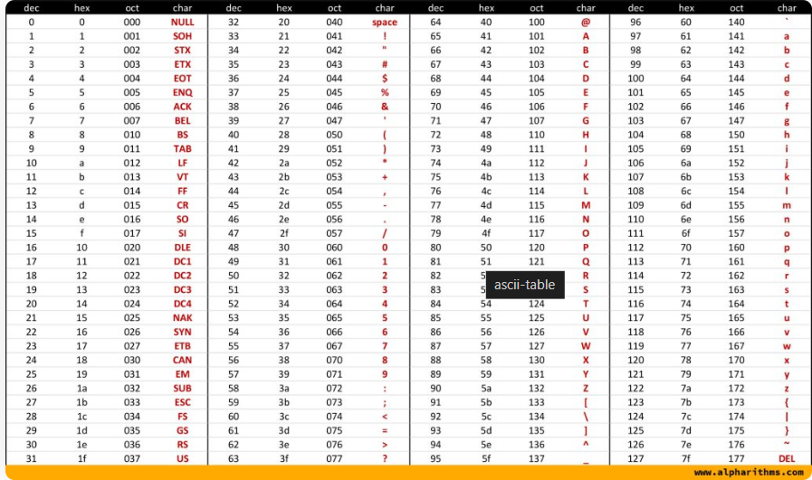

# Data Type

- Data type is represent which kind of data will be store in variable. we always decalre type of type in c++ language because it is a statically typed language.

## Types of Data 

### Primitive Data Type.
- integer - 2,3,etc not with decimal  - 4Bytes
- char  - 'A' , 'b' etc.   - 1Bytes
- float  - Decimal Values. - 4Bytes
- bool  - true,false.   - 1Bytes
- double  - more efficiently handle big decimal number it is double than float.   -8Bytes

## Binary Number system 
- Computer follows binary number system.
- single digit Bits => and collection of 8bits are called one byte.
- so 4bytes means = 4*8 = 32bits.(reserve spaces) - 0,1 converts . 25 -> 11001

## Character Store
- Character are store in forms of ASCII(ASCII stands for American Standard Code for Information Interchange.) value.

- 'A' - 65 , ... 'Z' - 96

- 'a' - 97 , 'b' - 98 -

- 

## boolean
- true or false
- interanlly true is 1 and false is 0. in memory store accordingly.

## Double
- Double like float which containes larger values.

