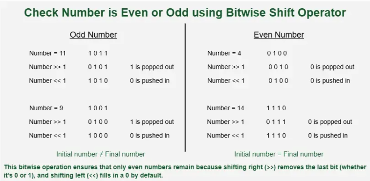

# Problem statement & approach
>Given a number n, check whether it is even or odd. Return true for even and false for odd.
Examples: 
```t
Input: 2 
Output: true

Input: 5
Output: false
```
## Approach: By Finding the Remainder
> We can check the remainder when divided by 2. If the remainder is 0, the number is even; otherwise, it is odd

```python
n = int(input("Enter Number: "))

if(n % 2 == 0):
    print(f"The Given number {n} is even")

elif(n % 2 != 0):
    print(f"The Given number {n} is odd")

else:
    print("Something Went Wrong")

```
- Time Complexity - O(1)
- Space Complexity - O(1)


## Approach: Using Bitwise AND Operator
> The last bit of all odd numbers is always 1, while for even numbers it’s 0. So, when performing bitwise AND operation with 1, odd numbers give 1, and even numbers give 0.

```t
Ex: 5 (101)  -> 101
                &  001
         ----
    001 , so this we can say it is an odd number.
```


```python
# A Python3 code program
# to check for even or odd
def isEven(n):

    # n&1 is 1, then odd, else even
    if (n & 1) == 0:
    	return True
    else:
    	return False

if __name__ == "__main__":
  n = 101
  if isEven(n):
      print("true")
  else:
      print("false")
```
- Time Complexity - O(1)
- Space Complexity - O(1)


### Approach: Using Bitwise Shift Operators


>Right shifting n >> 1 removes the last bit. Shifting back restores it. If the result matches the original number, it's even.


## learnings

- Use of Control Structure

- Time Complexity - O(1)
- Space Complexity - O(1)

```python
# A Python3 code program
# to check for even or odd
def isEven(n):

    if n == (n >> 1) << 1:
    	return True
    else:
    	return False

if __name__ == "__main__":
  n = 4
  if isEven(n):
      print("true")
  else:
      print("false")
```

## Approach
- Functional 
- Procigral

## Mistakes
- in function no return type specified by me. so it shoudn't be like that function should be returning something, and in parameter if you have write function prototype, also mantion type both beacause function take it's implicit type as a int.